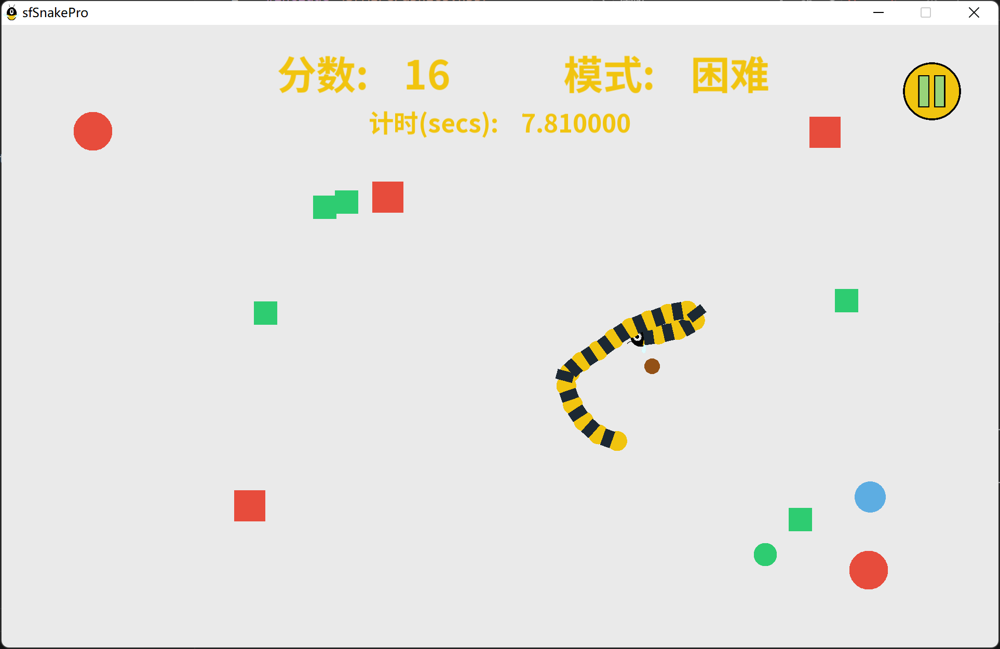
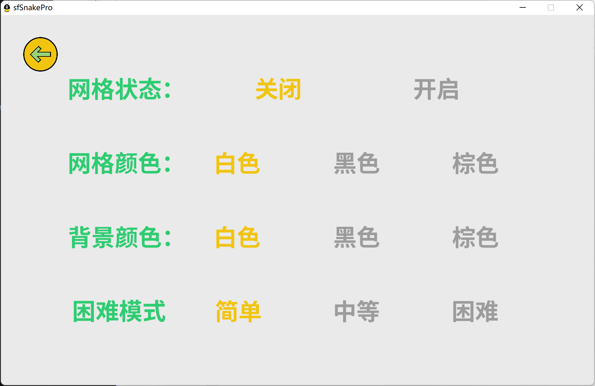

# 贪吃蛇游戏设计说明

**20307130350 陈丹纯 信息安全 2023/06/16**

**游戏演示视频链接：**

## 写在前面

相对于[原版](https://github.com/jhpy1024/sfSnake)，本设计增加了以下功能：

1. 总体游戏设置：
   * 界面设计
     1. 由原来的键盘选择游戏改成鼠标按键选择。
     2. 增加了新的界面（如设置/帮助/关于界面）
     3. 整体界面的修改
        可以修改背景的颜色(提供白色、黑色、褐色三种)，允许显示(或关闭显示)网格，网格的颜色可以设置(提供白色、黑色、褐色三种)
     4. 新增了游戏暂停/返回/重启功能。
     5. 增加了游戏界面计分、计时、难度模式的展示。
   * 游戏模式
     1. 难度模式：游戏共分成三种难度模式，分别为简单/中等/困难。
     2. 死亡方式：原版仅贪吃蛇咬到自己的时候死亡，新增了**撞到屏障而死、长期没有进食导致饿死**这两种情况。并且根据游戏的难度模式设置了不同的屏障自动生成时间、没有进食而死的时间。
     3. 速度模式：游戏设置了多种速度模式，并且根据游戏的难度模式为贪吃蛇设置不同的初始速度。

eg：游戏帮助界面展示游戏规则


2. 贪食蛇的控制

   * 方向控制

     源代码只支持4个方向的运行，并且用的是键盘的up/down/left/right控制，**新增用w/s/a/d控制方向的功能。**

     **增加可以通过鼠标控制贪食蛇的运动。**当按下鼠标键时，设置一个方向向量，该方向向量为鼠标所在位置(MousePosition)与蛇头所在位置(SnakePosition)的差值。下一时刻，贪食蛇按照该向量的方向运动;运动的距离为1个标准单位。

     此外，设置阈值，要求原方向和新速度方向之间的夹角不能大于160°，这样**修复了贪吃蛇反向死亡和鼠标按键容易自杀的bug**，增加了游戏友好体验。

   * 速度控制

     新增按空格键加速2x的功能。

     根据游戏的难度模式为贪吃蛇设置不同的初始速度。简单、中等、困难速度比为{1：2：3}

   * 外形美化

     绘制精灵版本的贪食蛇源代码中的贪食蛇绘制过于简单一仅仅使用了矩形绘制。要求更改贪食蛇的绘制方法，头部使用图片，通过sprite进行绘制，其余部分使用园叠加黑色的矩形块绘制。

     图片素材来源网络。

   * 死亡逻辑

     1. 自杀
     2. 长期没进食会饿死
     3. 撞墙而死

3. 水果的控制
   源代码只支持 1 种水果，颜色随机且贪食蛇增加的长度固定。现增加黑色、棕色、红、蓝色、绿色、共5种水果，且贪食蛇吃了黑色、棕色水果不增加其长度，但是可以等效消除一个屏障；红色、蓝色、绿色水果增加的长度分别为 3、2、1;增加的长度在贪食蛇的尾部一假设初始是叠加在一起的。
   系统随机生成上述5种水果，保持黑色和褐色水果所占比例为25%，其他的占75%。

4. 屏障的控制

   原版并没有障碍物，本游戏新增了障碍物并且触碰即死。增加黑色、棕色、红、蓝色、绿色、共5种屏障，系统**每间隔一段时间自动**随机生成上述5种屏障，保持黑色和褐色屏障所占比例为25%，其他的占75%。

   贪吃蛇每次吃到黑色、棕色水果可以等效消除一个屏障。


## Game.cpp游戏主入口设计

### 主要方法

在 `Game.run()` 方法中

```c++
while (window_.isOpen())
```

这是游戏主循环。

```c++
while (timeSinceLastUpdate > TimePerFrame_)
```

这是游戏控制帧率的逻辑循环和渲染循环。

由于是单线程，逻辑和渲染没有分离，所以在游戏中锁死了 100fps 的帧率，但是在正常的电脑上都可以跑，核显都很流畅。

```c++
Game.handleInput(); // 处理输入
Game.update(sf::Time delta); // 处理游戏更新
Game.render() // 处理游戏渲染
```

上述方法会将参数传递给当前的界面进行操作

### 类静态成员

游戏中的全局参数设置为类的静态成员

**全局资源类** `Game::Color` 类设定了全局的颜色，定义了蛇、水果、网格、背景、按钮、文字的颜色，根据谷歌的配色方案，做到协调统一。

**全局窗口大小设置** `Game::GlobalVideoMode` 设定窗口长宽比为桌面分辨率的3/4，同时所有的界面缩放和按钮缩放都是与 `Game::GlobalVideoMode.width` 关联的常数，保证了不同分辨率屏幕下一致的体验。

**全局字体** `Game::GlobalFont` 和**全局标题动画** `Game::GlobalTitle` 保证了不同界面中字体和标题动画的一致性。

**网格可见性** `Game::GridVisibility`、**网格颜色** `Game::GridColor`、**背景颜色** `Game::BackgroundColor`是全局设置，在设置界面调整之后可以全局生效。

**键盘锁、鼠标锁**，防止多次按钮触发和鼠标连续操作。

**主界面智能指针** `Game::MainScreen`，指向当前界面对象。

**界面辅助指针** `Game::TmpScreen`，指向当前界面的前面一个对象，便于用返回按钮返回原来界面。

**游戏界面指针** `Game::TmpGameScreen`，指向游戏界面对象，在暂停界面中使用。

**游戏界面时钟** `Game::GameScreenPausedTime`, 指向游戏界面时钟，暂停时游戏界面时钟也会暂停。

---

## 游戏难度设置


在`Game.cpp`中设置游戏难度相关属性：

* 游戏难度：`Game::DifficultyMode`，用int表示，0-简单、1-中等、2-困难
* 屏障生成时间间隔： `float Game::BarrierGeneratedTimesMode[] = {3.f,2.f,1.f};`
* 最长不进食时间间隔：`float Game::MaxLastEatIntervalMode[] = {30.f,10.f,5.f};`
* 速度模式：`int[3] Game::speedMode` 

## 界面设计

全部使用鼠标操作，点击按钮切换界面或者选项，只有在游戏主界面中可以使用键盘操作。

统一全局颜色。

UI素材来源于GitHub项目。

界面包括

- 菜单界面 MenuScreen
- 游戏主界面 GameScreen
- 暂停界面 PauseScreen
- 选项界面 OptionScreen
- 游戏结束页面 GameOverScreen
- 帮助界面 HelpScreen
- 关于界面 AboutScreen

此处介绍菜单界面和游戏主界面，其他的界面比较简单而且架构类似，基本上就是布局上的区别。

### 菜单界面 MenuScreen

贪吃蛇标题使用网上找的素材，也设计了统一的按钮和交互逻辑。这是游戏的主入口。其中有按钮、选项按钮、游戏标题动画。


#### 按钮元素 Button

按钮元素使用网上找的素材，图片渲染，当鼠标在这个圆形内部的时候，整体颜色加上一层绿色的覆盖。点击可跳转，同时加上鼠标锁防止多次点击，0.5秒之后解锁。

按钮元素在所有界面中都有，可复用程度高。

#### 选项按钮元素 OptionButton

这个元素用于文字选项，在鼠标移动到文字上时，文字增加下划线，文字点击后更改颜色，并根据需要跳转界面。

选项按钮元素在菜单界面、暂停界面、游戏结束页面和选项界面中使用，可以复用。

### 游戏主界面 GameScreen

游戏主界面中包含蛇、水果、网格（可选）、暂停按钮、实时分数、难度模式、计时时钟。



### 选项界面 OptionScreen

都是Button元素，聚焦渲染下划线，选中渲染黄色。

提供：网格状态、网格颜色、背景颜色、难度模式。




#### 蛇元素 Snake

##### **一、蛇的定义**

蛇由蛇头、蛇身体、蛇关节组成。

蛇头是蛇头图片，身体是半径为 $r$ 的黄色圆形，关节是长乘宽为 $r \times \sqrt{3}r$ 的黑色矩形。

路径节点用一个 `deque<SnakePathNode>` 存储，每次更新游戏数据的时候，根据前进方向 `direction_` 在头位置插入一个（或者两个，如果加速的情况下）路径节点，同时判断尾部节点是否有需要加长的部分，如果需要加长则不删除，否则删除尾部节点（或者两个）。

每个身体节点由10个路径节点定义，每个关节节点是相邻两个身体节点的中间节点，其法向方向由相邻两个关节的差向量决定。

即对于一个长度为 $x$ 的蛇（不包括头），蛇头定义为第0个节点，则 `deque`的长度为 $10x + 1$，第 $10k$ 个节点为身体节点， 第 $10k + 5$ 个节点是关节节点。

相比源代码中使用的 `vector<SnakeNode>`，`SnakeNode` 类中有方向和位置信息，而现在的 `deque<SnakePathNode>`中只存储了位置信息，空间占用率降低了。同时源代码中的蛇更新需要 `vector` 整体向前移动一位，时间复杂度 $O(n)$；现在使用 `deque` 只需要操作头尾结点，时间复杂度 $O(1)$。

##### **二、蛇的渲染**

保证在越过边界之后会从对面边界穿出。源代码中直接将蛇节点修改到对面的位置，在源代码的条件下是可以的。但是修改版的代码中，中间节点的方向是又前后两个身体节点共同定义，可能会导致方向计算错误和渲染中的bug。

解决方案是，更新时不修改蛇相对屏幕位置，而每一帧判断尾结点是否在屏幕内，再根据尾结点位置统一修正所有蛇节点，保证了蛇不会因为长时间游戏而跑到很远的地方导致数据溢出。同时定义了 `toWindow()` 函数计算节点在屏幕中的位置，保证蛇能够在正确位置渲染和根据首节点位置进行交互。

当身体节点一部分在边界内的时候，应该会有一部分渲染在对面的位置，否则就会在对面突然出现一个节点，不够优雅和丝滑。所以我判断了是否这个节点的渲染半径包含边界，包含的话，就让它在对面也渲染一次。

##### **三、蛇的游戏逻辑判定**

当蛇头渲染半径和水果的渲染半径相切的时候，判定为吃到水果，则获取水果的得分。

当蛇一定时间没有进食水果的时候，判定为饿死，由`Snake`新增的`bool die_`判断。

当蛇触碰到屏障的时候，判定为撞墙死亡，由`Snake` 新增的 `bool hitBarrier_`判断。

当蛇头渲染半径与30个路径节点以外的路径节点渲染半径相交的时候，判断为死亡。这里的30个路径节点保证了一部分锐角转弯的可能性。

当蛇头方向和新的速度方向夹角大于160°的时候，鼠标/键盘按键无效，这样保证了贪吃蛇不会直接180°转弯，并且降低了锐角转弯死亡的可能性，增加用户友好体验。

#### 水果元素 Fruit

##### 水果定义

水果元素源代码中用 `vector` 存储，这里改成 `deque` 存储，也是便于修改删除节点。同时源代码中的水果元素是类，而我修改成结构，因为水果类的成员不多，没有私有的必要，而且大多需要在外部访问。

水果的得分也是直接写死在结构里面，在随机生成水果的时候作为构造函数的参数传递，并且根据得分不同设置不同的水果大小。

##### 水果的渲染

当游戏界面中水果的数量（即 `deque.size()` ) 小于等于5的时候，随机生成水果。

#### 屏障元素 Barrier

##### Barrier定义

采用结构体，结构类似 Fruit，也是用 `deque` 存储，便于修改删除节点。颜色直接采用和水果相同的颜色逻辑，大小也按照不同的颜色有所区分。

##### Barrier的渲染

Barrier会间隔相同时间自动随机生成屏障。

#### 网格元素 Grid

网格使用与屏幕长宽相关的条状矩形渲染。


## 编译环境说明

见`CMakeLists.txt`.

SFML用的是debug版本。链接的时候`-d`:

`target_link_libraries(main PRIVATE sfml-system-d sfml-window-d sfml-graphics-d sfml-audio-d sfml-network-d)`


